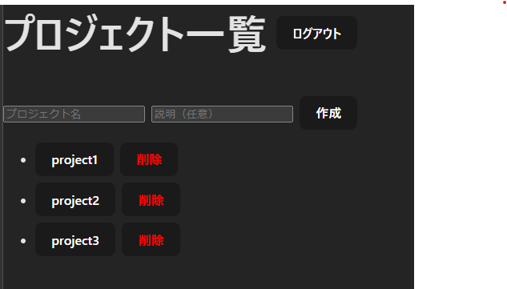
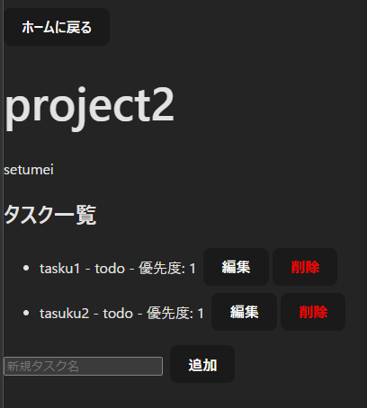

# プロジェクト管理アプリ (FastAPI + PostgreSQL + Docker)

## 概要
FastAPIをバックエンドに、PostgreSQLとDockerを組み合わせた高速・セキュアなプロジェクト管理アプリです。  
ユーザー登録・認証、プロジェクト・タスク・コメント管理を非同期処理で実装しており、就活向けポートフォリオとして**バックエンド設計力と実装力**を示せます。

---

## デモ・アクセス

- バックエンド (API): [https://purojekuto-bakku.onrender.com]
  - APIドキュメント: [https://purojekuto-bakku.onrender.com/docs]

- フロントエンド: [https://purojekuto-furonto.onrender.com]






## 技術スタック

- **バックエンド**
  - Python 3.11+
  - FastAPI (非同期APIフレームワーク)
  - SQLAlchemy (async ORM)
  - asyncpg (非同期PostgreSQLドライバ)
  - Alembic (DBマイグレーション)
  - Passlib[argon2] (安全なパスワードハッシュ)
  - Python-JOSE (JWT認証)
  - Pydantic (データバリデーション)

- **データベース**
  - PostgreSQL 16

- **フロントエンド**
  - Vite (開発環境)

- **コンテナ管理**
  - Docker / Docker Compose
  - DB永続化・依存関係管理済み

---

## バックエンド機能

### ユーザー
- ユーザー登録・ログイン (JWT認証)
- 認証済みユーザー情報取得
- パスワードハッシュ化によるセキュリティ管理

### プロジェクト
- CRUD (作成・取得・削除)
- 所有者チェックによるアクセス制御
- 非同期SQLAlchemyで高速なDB操作

### タスク
- プロジェクト単位でのタスク管理
- 所有者権限チェック
- ステータス・優先度管理

### コメント
- タスクに紐づくコメントの作成・取得・削除
- ユーザー紐付け済みでセキュア

---

## 実行方法

### バックエンド

docker-compose up --build


APIドキュメント確認: http://localhost:8000/docs

## フロントエンド
cd frontend
npm install
npm run dev


## 認証方式

JWTベース

Authorization: Bearer <token> ヘッダーでAPIアクセス

フロント・バック両方でセキュアに動作


## テスト & カバレッジ

全機能に対してpytestで単体テスト実施（24件すべてPASS）

非同期API、ユーザー認証、CRUD操作を含む

テストカバレッジ: 90%（未カバーは主に認証・DB初期化部分）

pytestでの実行例:
```bash
pytest
============================= test session starts ==============================
collected 24 items / 24 passed
```


## 強調ポイント

非同期API + 非同期ORMによる高パフォーマンス設計

JWT認証 + パスワードハッシュによるセキュリティ管理

DBスキーマ設計 + リレーション管理（ユーザー・プロジェクト・タスク・コメント）

Dockerによる環境依存排除・コンテナ管理

FastAPI自動ドキュメントでREST API仕様の明確化